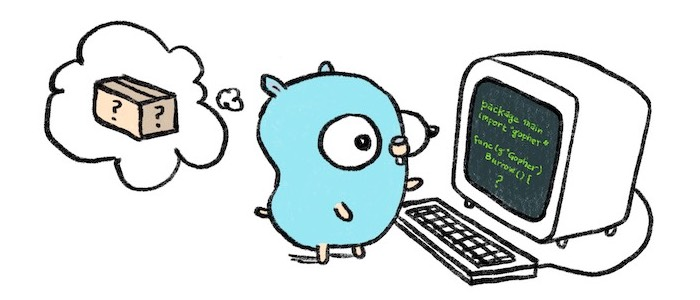

# Aprendendo Golang

  

## O que é Golang?

Go é uma linguagem de programação criada pela Google e lançada em código livre em novembro de 2009. É uma linguagem compilada e focada em produtividade e programação concorrente.

### Recursos utilizados:

Aprenda Go - Ellen Körbes:
https://www.youtube.com/playlist?list=PLCKpcjBB_VlBsxJ9IseNxFllf-UFEXOdg

Site oficial de pacotes de GO:
https://pkg.go.dev/
https://pkg.go.dev/std

Livro Let's Go - Alex Edwards
https://lets-go.alexedwards.net/
